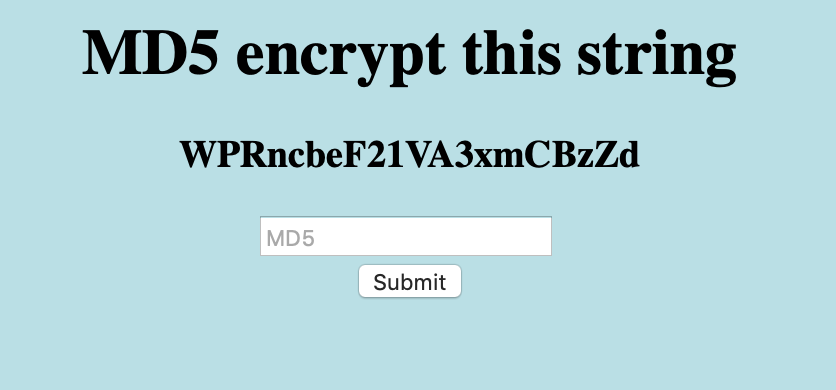

# Emdee five for life

> Can you encrypt fast enough?

This is a little web challenge. I start by launching it and opening it in my
browser. I get a little bit of text with the suggestion to MD5 encrypt a string,
a random-looking string, and a form.

{: style="max-width:500px"}

I try to take the random-looking string and hash it with MD5, and try to submit
the result of that.

    echo -n "WPRncbeF21VA3xmCBzZd" | md5sum
    dd2423a16f6032ebacf2c473371db003  -

However, submitting this does not work. I get an error saying that I am too
slow. And upon refreshing, a new random-looking string appears.

I try refreshing the page a few times. Every second or so, a new random code
appears. It seems as if the only way I can get this to work would be to
automate it.

I look at the source code.

```html
<html>
<head>
<title>emdee five for life</title>
</head>
<body style="background-color:powderblue;">
<h1 align='center'>MD5 encrypt this string</h1><h3 align='center'>UPYies9vayEn6v1yZoQU</h3><center><form action="" method="post">
<input type="text" name="hash" placeholder="MD5" align='center'></input>
</br>
<input type="submit" value="Submit"></input>
</form></center>
</body>
</html>
```

It seems like I could use some basic shell scripting to scrape the string,
MD5 it and then submit back the hased result. I first figure out how to extract
the random-looking string from the HTML, and after playing with `sed`, I settle
on a simple `egrep` method to do it.

```bash
string=`curl "$1" | egrep -o '[a-zA-Z0-9]{20}'`
echo got string $string
md5=`echo -n $string | md5sum | tr -d ' -'`
echo got md5 $md5
```

I save this file as `fetch.sh` and run it. It correctly produces the random
string and its MD5 hash. Next I figure out a way to submit the MD5 back into
the website form. To do this, I simply open it in Safari, submit the form, and
let Safari generate me a `curl` command to generate the same request. I minify
the output to just what I really need, and add this to the script `fetch.sh`.

```bash
curl "$1" -XPOST --data "hash=$md5"
```

Running this does not produce the expected result. It tells me that I am
"too slow". When I inspected the web request in Safari, I saw that the site
sets a `PHPSESSID` cookie. I guess that I probably need to set that cookie
as well. That means I have to change my fetching script a bit. I rewrite it
a bit, using files instead of variables.

```bash
# make initial request, save response and headers.
curl -v "$1" > response 2> headers

# extract phpsessid.
grep PHPSESSID headers | egrep -o '[a-z0-9]{26}' > phpsessid

# extract random string.
grep h3 response | egrep -o '[a-zA-Z0-9]{20}' > string

# generate md5.
echo -n $(< string) | md5sum | tr -d ' -' > md5

curl "$1" -XPOST -H "Cookie: PHPSESSID=$(< phpsessid)" --data "hash=$(< md5)"
```

I run this script, and voilà, it works. As response, I get a HTML reply
containing a token.

```html
<html>
<head>
<title>emdee five for life</title>
</head>
<body style="background-color:powderblue;">
<h1 align='center'>MD5 encrypt this string</h1><h3 align='center'>x7aTFEJLzmL4iuks6Ier</h3><p align='center'>HTB{xxxx_xxxxxxxxx_xxxx}</p><center><form action="" method="post">
<input type="text" name="hash" placeholder="MD5" align='center'></input>
</br>
<input type="submit" value="Submit"></input>
</form></center>
</body>
</html>
```

I submit that token, and it is accepted.
