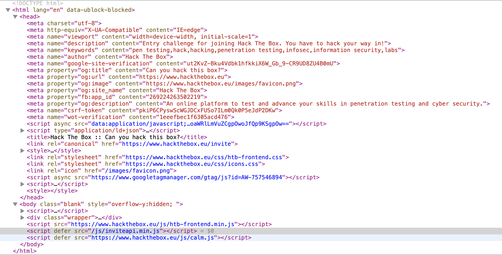

# Invitation

Upon trying to create an account, I am presented with a little window, asking
for an invite code, along with the suggestion to hack your way in. 

{: style="max-width:500px"}

Since there are no obvious signs of any code being present in the website itself,
and it does say that *feel free to hack your way in*, I guess I need to get out
the source of the website and see if I can spot anything useful.



I the actual form itself is not really interesting, just a standard POST form
with a token and the entered value. Also no comments in the HTML with anything
I could try.

I look at the metadata to see if there is anything useful, but negative. The only
other thing that might be interesting is the JavaScript code, so I start to
examine those.

There is one that is embedded base64-encoded. My browser can decode that, but it
just seems to be something to do with analytics. Analytics seems to be everywhere
these days.

Next there is one, an external one. The domain, `googletagmanager.com`, doesn't
sound like this would be the one. Also, it is obfuscated. Seems unlikely to be
interesting.

Next, there is the `htb-frontend.min.js`. It is a minified JavaScript source,
and very long, so again, I doubt this is of interest.

This brings me to `inviteapi.min.js`. Now, this seems interesting to me. 
The name itself suggests it has something to do with invite codes, and also
it is short and somewhat minified.

I check to see if in the same folder a `inviteapi.js` exists that is not minified,
but negative. Was worth a try anyways.

The code in this file is as follows:

```js
eval(function(p, a, c, k, e, d) {
    e = function(c) {
        return c.toString(36)
    };
    if (!''.replace(/^/, String)) {
        while (c--) {
            d[c.toString(a)] = k[c] || c.toString(a)
        }
        k = [function(e) {
            return d[e]
        }];
        e = function() {
            return '\\w+'
        };
        c = 1
    }
    ;
    while (c--) {
        if (k[c]) {
            p = p.replace(new RegExp('\\b' + e(c) + '\\b', 'g'), k[c])
        }
    }
    return p
}('1 i(4){h 8={"4":4};$.9({a:"7",5:"6",g:8,b:\'/d/e/n\',c:1(0){3.2(0)},f:1(0){3.2(0)}})}1 j(){$.9({a:"7",5:"6",b:\'/d/e/k/l/m\',c:1(0){3.2(0)},f:1(0){3.2(0)}})}', 24, 24, 'response|function|log|console|code|dataType|json|POST|formData|ajax|type|url|success|api|invite|error|data|var|verifyInviteCode|makeInviteCode|how|to|generate|verify'.split('|'), 0, {}))
```

So what this is doing is somewhat interesting. There is a function that takes
some obfuscated code, it does something with it (replacing some things) and
eventually returns some real code as a string, which is then evaluated.

I change the `eval()` call into a `console.log()`, which is the JavaScript
equivalent of a print statement, and save the result as `inviteapi.print.js`.
Running that with

    node inviteapi.print.js

I get some new JavaScript output, which looks promising. I save the result
as `inviteapi.output.js`.

```js
function verifyInviteCode(code){var formData={"code":code};$.ajax({type:"POST",dataType:"json",data:formData,url:'/api/invite/verify',success:function(response){console.log(response)},error:function(response){console.log(response)}})}function makeInviteCode(){$.ajax({type:"POST",dataType:"json",url:'/api/invite/how/to/generate',success:function(response){console.log(response)},error:function(response){console.log(response)}})}
```

I can already see that this looks promising, but it's not formatted properly. 
I am too lazy to do it myself, so I do a quick google search to find some kind
of code formatter I can use. I find `prettier`, which is on Homebrew, and thus
I install it with

    brew install prettier

I use prettier to format the output, resulting in `inviteapi.prettier.js`.

    prettier inviteapi.output.js > inviteapi.prettier.js

The result looks a lot more legible already.

```js
function verifyInviteCode(code) {
  var formData = { code: code };
  $.ajax({
    type: "POST",
    dataType: "json",
    data: formData,
    url: "/api/invite/verify",
    success: function(response) {
      console.log(response);
    },
    error: function(response) {
      console.log(response);
    }
  });
}
function makeInviteCode() {
  $.ajax({
    type: "POST",
    dataType: "json",
    url: "/api/invite/how/to/generate",
    success: function(response) {
      console.log(response);
    },
    error: function(response) {
      console.log(response);
    }
  });
}
```

These two functions are loaded in my browser, because they have been eval'ed.
So, next I go back to my browser, and try them out in the console.

In Safari, that doesn't work. I just get *undefined* as a result.

    > makeInviteCode()
    < undefined

I try it in Firefox, one of these browsers must work. And it turns out, it
does indeed. The response I get back looks like this.

```js
{
    0: 200,
    success: 1,
    data: {
        data: "Va beqre gb trarengr gur vaivgr pbqr, znxr n CBFG erdhrfg gb /ncv/vaivgr/trarengr",
        enctype: "ROT13",
    }
}
```

The data is obviously an obfuscated message, and it also tells me how it
is obfuscated. ROT13 is a bit of a joke, it transposes all alphabetical
characters by 13 places. When applied twice, it is therefore undone.

I think about how I can apply a rot13 without too much effort. There does
not seem to be a `rot13` binary on my system to do that. 

I find a [Ruby gem named *rot13*](https://rubygems.org/gems/rot13/versions/0.1.3), 
this seems like it should do what I want. I install it in my local system
with

    gem install rot13

Then I write a little Ruby script to decode it for me.

```ruby
require 'rot13'

puts Rot13.rotate("Va beqre gb trarengr gur vaivgr pbqr, znxr n CBFG erdhrfg gb /ncv/vaivgr/trarengr")
```

This outputs the message

> In order to generate the invite code, make a POST request to /api/invite/generate

So, I do that. The easiest way to generate a POST request I can think of is to
use `curl`. I use `man curl` to get the man page for it, to find out how to tell
it to generate a POST request. I think it was something with `-G`.

I manage to find the option, it is actually `-X`. I use the following command
to send a POST request:

    curl -X POST https://www.hackthebox.eu/api/invite/generate

I get back a JSON object that looks somewhat like this, where X is replaced with
some data.

```json
{"success":1,"data":{"code":"XXXXXXXXXXXXXXXXXXXXXXXXXXXXXXXXXXXXXXX=","format":"encoded"},"0":200}
```

Every invocation generates another code. I guess these codes are one-off. I try
one of the codes, however, it doesn't work. What captures my interest is that
it tells me that the format is encoded. That, and the fact that the invite code
ends with an equals sign tells me that it might be base64-encoded.

I take the encoded code and pipe it through `base64` to decode it and see
what I get. It seems that my hunch was right. I get a code like this, where
*X* represents capital characters.

    echo "XXXXXXXXXXXXXXXXXXXXXXXXXXXXXXXXXXXXXXX=" | base64 -D
    XXXXX-XXXXX-XXXXX-XXXXX-XXXXX

I submit this code, and it works. It lets me register an account.
