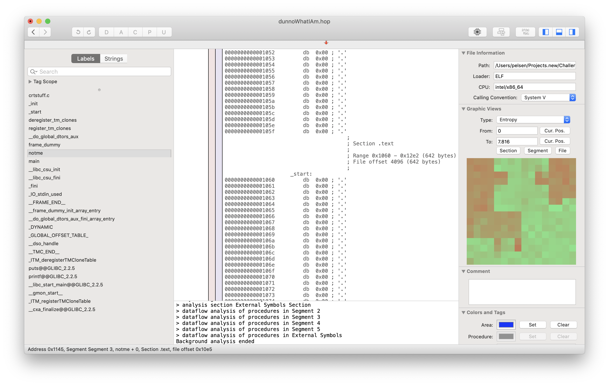
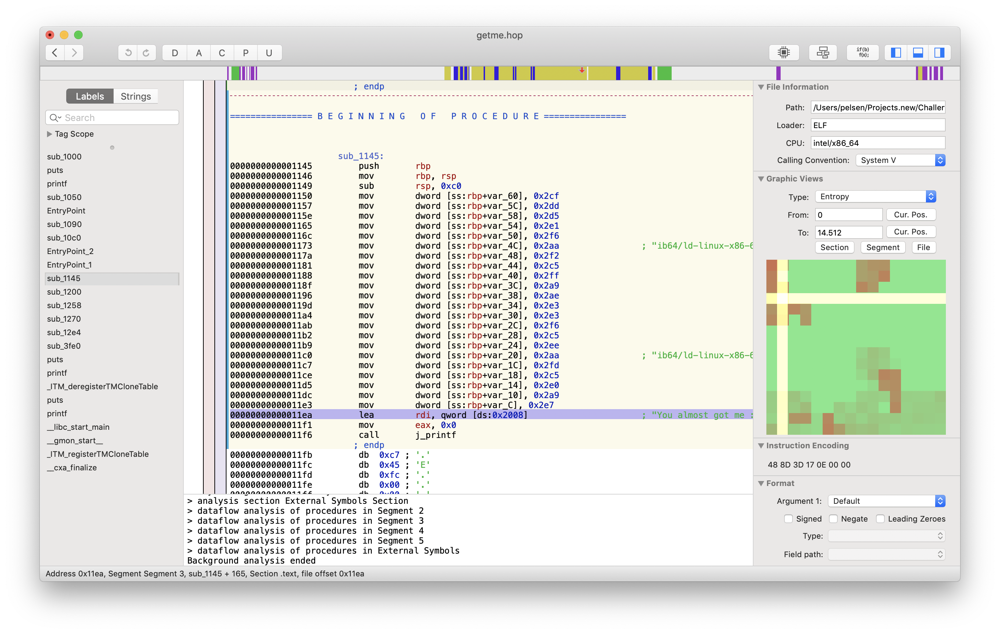
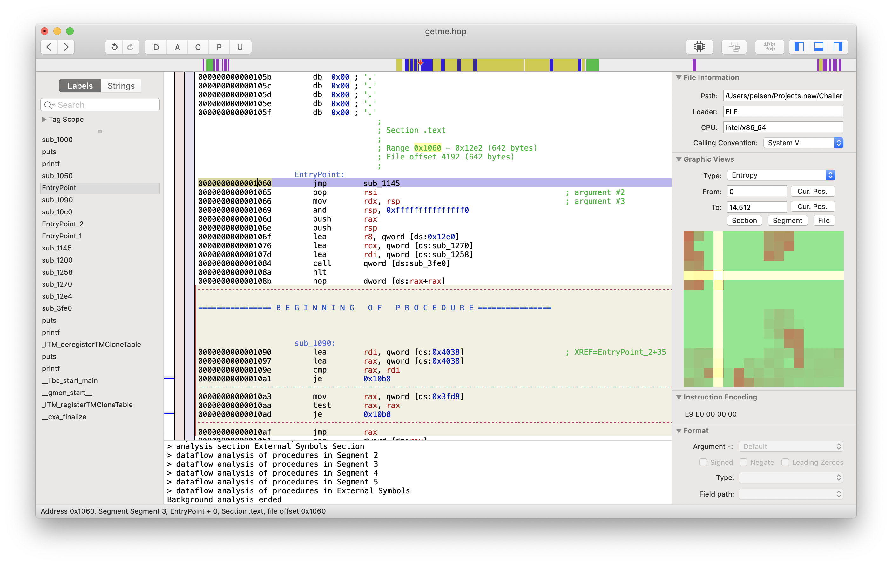

# DSYM

This is supposed to be an easy target to reverse. It comes with the description
*Try to add me and you will notme*. It is two binaries, called `getme` and
`dunnoWhatIAm`. They are both small, at around 10 KB. 

I first see what I am dealing here by using the `file` command.

    file getme
    getme: ELF 64-bit LSB pie executable x86-64, version 1 (SYSV), dynamically linked, interpreter /lib64/l, for GNU/Linux 3.2.0, BuildID[sha1]=7e677f09cf2db7922096c6da0ad55a1e9a6895b8, stripped
    file dunnoWhatIAm
    dunnoWhatIAm: ELF 64-bit LSB pie executable x86-64, version 1 (SYSV), dynamically linked, interpreter *empty*, for GNU/Linux 3.2.0, BuildID[sha1]=7e677f09cf2db7922096c6da0ad55a1e9a6895b8, with debug_info, not stripped

So these are both 64-bit Linux executables, which is not terribly surprising.
What is somewhat interesting is the second file. For the interpreter, it lists *empty*.
The interpreter is used with dynamically linked executables to link in whatever
dynamic libraries it depends on at launch. I don't yet know what it means if
this is empty.

Next I examine what libraries these executables link with. I do that with
the `ldd` tool.

    ldd getme
            linux-vdso.so.1 (0x00007ffe3bea1000)
            linux-vdso.so.1 (0x00007ffe3bea1000)
            /lib64/ld-linux-x86-64.so.2 (0x00007f77704b5000)
    ldd dunnoWhatIAm
            not a dynamic executable

Alright, so getme seems to be a standard executable. And `dunnoWhatIAm` is,
well, I don't know yet. 

I have setup a VM to run some tests in. I don't want to run untrusted binaries
on my own machine. So next I just execute them and see what happens. I think the
`getme` executable is going to say something like *notme*.

    $ ./getme
    $ ./dunnoWhatIAm
    -bash: ./dunnoWhatIAm: cannot execute binary file: Exec format error

Trying to execute `getme` yields no output at all, and executing `dunnoWhatIAm`
doesn't work at all. I want to take a closer look at these files, so I use the
`nm` tool to take a peek at the defined symbols in both.

    $ nm getme
    $ nm dunnoWhatIAm
    0000000000004038 B __bss_start
    0000000000004038 b completed.7389
                     w __cxa_finalize@@GLIBC_2.2.5
    0000000000004028 D __data_start
    0000000000004028 W data_start
    0000000000001090 t deregister_tm_clones
    0000000000001100 t __do_global_dtors_aux
    0000000000003df0 t __do_global_dtors_aux_fini_array_entry
    0000000000004030 D __dso_handle
    0000000000003df8 b _DYNAMIC
    0000000000004038 D _edata
    0000000000004040 B _end
    00000000000012e4 T _fini
    0000000000001140 t frame_dummy
    0000000000003de8 t __frame_dummy_init_array_entry
    00000000000021ac b __FRAME_END__
    0000000000004000 b _GLOBAL_OFFSET_TABLE_
                     w __gmon_start__
    0000000000002040 b __GNU_EH_FRAME_HDR
    0000000000001000 T _init
    0000000000003df0 t __init_array_end
    0000000000003de8 t __init_array_start
    0000000000002000 R _IO_stdin_used
                     w _ITM_deregisterTMCloneTable
                     w _ITM_registerTMCloneTable
    00000000000012e0 T __libc_csu_fini
    0000000000001270 T __libc_csu_init
                     U __libc_start_main@@GLIBC_2.2.5
    0000000000001258 T main
    0000000000001145 T notme
                     U printf@@GLIBC_2.2.5
                     U puts@@GLIBC_2.2.5
    00000000000010c0 t register_tm_clones
    0000000000001060 T _start
    0000000000004038 D __TMC_END__

This looks a bit more promising. The `dunnoWhatIAm` file seems to contain some
routines that look to be promising: a `_start`, a `main`, a `notme`. But I
don't know how to run it, or what the other file, `getme`, is supposed to do.

I have the idea of trying to use `dunnoWhatIAm` as a library and trying to
execute it like that. Or maybe trying to force loading it with `ld-linux`?

Not knowing exactly what to do, I decided to load these files into Hopper and
see what they look like.



The first one, `dunnoWhatIAm`, looks very strange. It has what seems to be an
ELF header and some sections, but they don't contain any data, only NULL bytes.

So next I took a look at the other one, again using Hopper. This time I found
a lot more interesting things. There is actually code in here! And something
that looks like it might be interesting.



This part seems quite interesting. There is a string in there that indicates
that this is something interesting:

> You almost got me :D
> Here is small price for you: 

The only issue is, how do I manage to execute this to see what it really
prints? I decide to patch the binary to jump to this code on startup and
run it, to see what it does. I do that by patching in a `jmp` instruction
to this routine, and then generating a new binary, `getme_mod`.



When I run this patched binary, it seems to give me what I want, where X is
numbers and lowercase letters:

    $ ./getme_mod
    You almost got me :D
    Here is a small price for you: XXXXXXXXXXXXXXXXXXXXXXXXXXXXXXXXXXXXXXXXXXXX

Now this is something interesting. That small price, it looks surprisingly
like hex-encoded data. So next I try to hex-decode it, using a small Ruby script
that looks like this, saved as `hexdecode.rb`.

```ruby
puts ARGV[0].scan(/../).map{|n| n.to_i(16).chr}.join
```

Running this with the target string gives me something that looks surprisingly
like the kind of key I would be expecting.

    ruby hexdecode.rb XXXXXXXXXXXXXXXXXXXXXXXXXXXXXXXXXXXXXXXXXXXX
    UGO{xxx_xxxxxx_xxx_xx}

But this doesn't seem to be quite right. It is supposed to look like `HTB{...}`.
Is this once more obfuscated? Looking at the characters, it seems evident that
it might be rot13-encoded, like the login token. So next I write a little Ruby
script to rot13-decode it, saved as `rot13.rb`.

```ruby
require 'rot13'

puts Rot13.rotate(ARGV[0])
```

Running this finally seems to give me the token I need.

    ruby rot13.rb UGO{xxx_xxxxxx_xxx_xx}
    HTB{xxx_xxxxxx_xxx_xx}

Submitting this token was successful.

## Addendum

After looking at what other people were doing online, I found out that the
`dunnoWhatIAm` file is not entirely useless, but rather contains the debug info
of the `getme` file. This is documented [here](https://sourceware.org/gdb/onlinedocs/gdb/Separate-Debug-Files.html).

This is evident by the fact that the `dunnoWhatIAm` file is listed in the
`.gnu_debuglink` section of `getme`. I could have used this to load the debug
symols into `gdb`.
