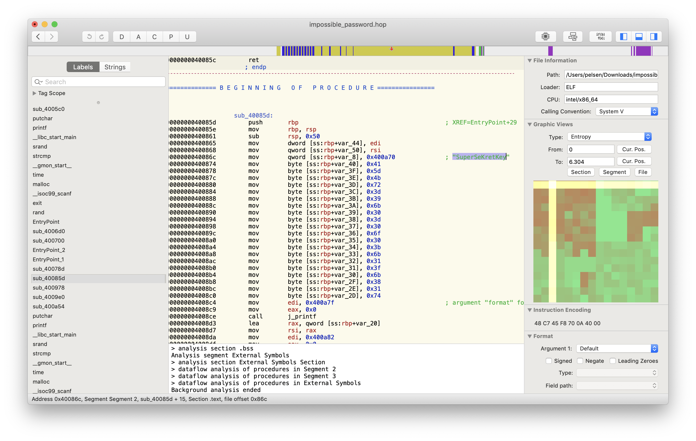
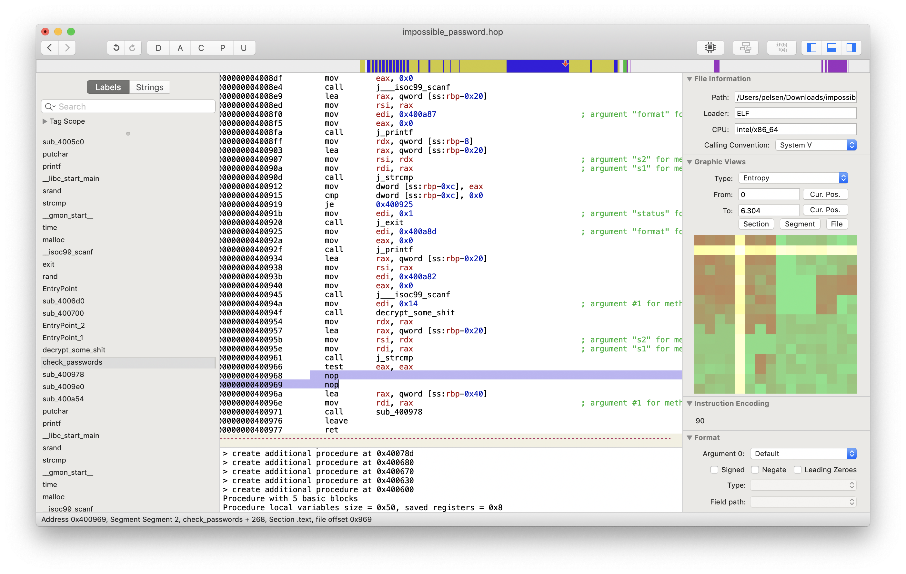

# Impossible Password

> Are you able to cheat me and get the flag? 

This is a 6 KB executable. I start by using the `file` tool to see what
the specs are.

    $ file impossible_password.bin
    impossible_password.bin: ELF 64-bit LSB executable, x86-64, version 1 (SYSV), dynamically linked, interpreter /lib64/ld-linux-x86-64.so.2, for GNU/Linux 2.6.32, BuildID[sha1]=ba116ba1912a8c3779ddeb579404e2fdf34b1568, stripped

As expected, a normal Linux executable. 

Next, I try to just execute it to see what happens. It turns out, it does
something strange, where it waits for input, and then echoes it back, enclosed
in brackets. Here is what it looks like when I use `password` as input and
hit enter.

    $ ./impossible_password.bin
    * password
    [password]

Since running it didn't show anything useful, my next best idea is to load it
in the disassembler and see what we get out of it.



I find something that seems interesting in Hopper, which is a key, `SuperSeKretKey`.
This looks to be some sort of password. Next I try popping that into the program
to see what happens next.

    $ ./impossible_password.bin
    * SuperSeKretKey
    [SuperSeKretKey]
    **

This seems to have worked, as I am now prompted again to enter something.
I go back to Hopper to see if there are any clues as to what the next password
might be.

There is another section, right underneath where the reference to the previous
key is, that stores a string into memory:

    A]Kr=9k0=0o0;k1?k81t

I tried using that string for the second password, but it didn't work. I look
into the assembly some more. This is the decompiled source for the function
that checks the passwords:

```c
int sub_40085d(int arg0, int arg1) {
    printf(0x400a7f);
    __isoc99_scanf(0x400a82, var_20);
    printf("[%s]\n", var_20);
    if (strcmp(var_20, "SuperSeKretKey") != 0x0) {
            rax = exit(0x1);
    }
    else {
            printf(0x400a8d);
            __isoc99_scanf(0x400a82, var_20);
            rax = sub_40078d(0x14);
            rax = strcmp(var_20, rax);
            if (rax == 0x0) {
                    rax = sub_400978(0x41);
            }
    }
    return rax;
}
```

It compares the first password, and exits if it is wrong. Then it checks the
second password, and only proceeds if it is right. Now, for the second password,
it is comparing it to the result of a subroutine. I look at that subroutine.

This is the decompiled source of that subroutine.

```c
int sub_40078d(int arg0) {
    var_24 = arg0;
    rdx = time(0x0) * var_24;
    *(int32_t *)0x601074 = *(int32_t *)0x601074 + 0x1;
    rax = *(int32_t *)0x601074;
    srand(rax + rdx);
    var_10 = malloc(sign_extend_32(var_24 + 0x1));
    if (var_10 != 0x0) {
            for (var_4 = 0x0; var_4 < var_24; var_4 = var_4 + 0x1) {
                    rax = rand();
                    temp_3 = rax % (0x7f - 0x21);
                    *(int8_t *)(sign_extend_64(var_4) + var_10) = 0x21 + temp_3;
            }
            *(int8_t *)(var_10 + sign_extend_64(var_24)) = 0x0;
            rax = var_10;
    }
    else {
            rax = exit(0x1);
    }
    return rax;
}
```

This allocates some memory with the `malloc()` call, and writes to it. It uses
`srand()` seeded with the current time, and `rand()`. That means that most likely,
what this returns is really going to be random. 

I therefore decide to try to just patch out the check for the second password.
At offset `0x400968`, where there was a conditional jump, checking the return
of the `strcmp()`, I just add two `nop` instructions.

```asm
jne        0x40097
```



I use this to produce a new binary, `impossible_password_patched`. This would
take any password for the second stage. I test by running it to confirm that
it works, where `X` are hexadecimal characters.

    $ ./impossible_password_patched
    * SuperSeKretKey
    [SuperSeKretKey]
    ** abc
    HTB{XXXXXXXXXXXXXXX}

I try by submitting this token and it works.
